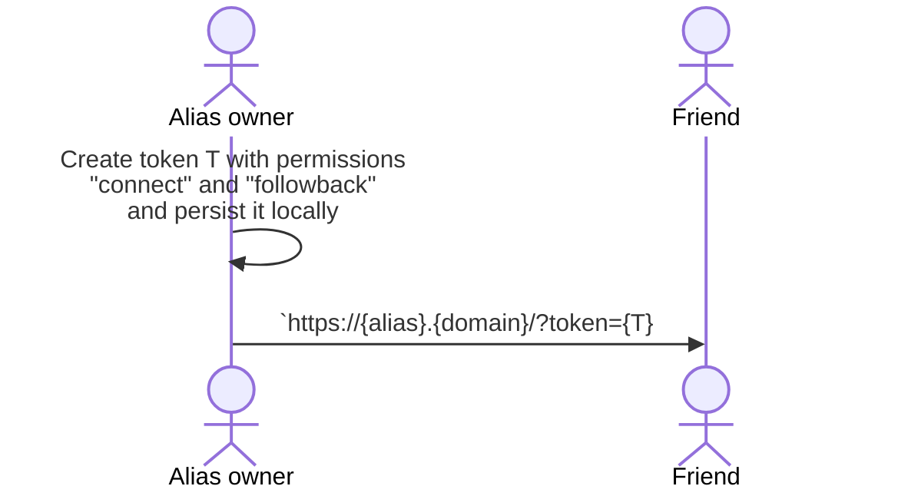
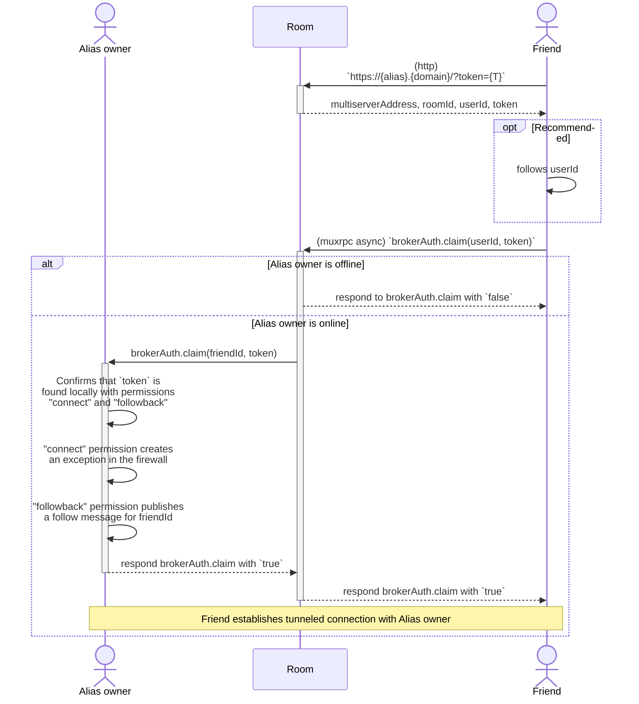
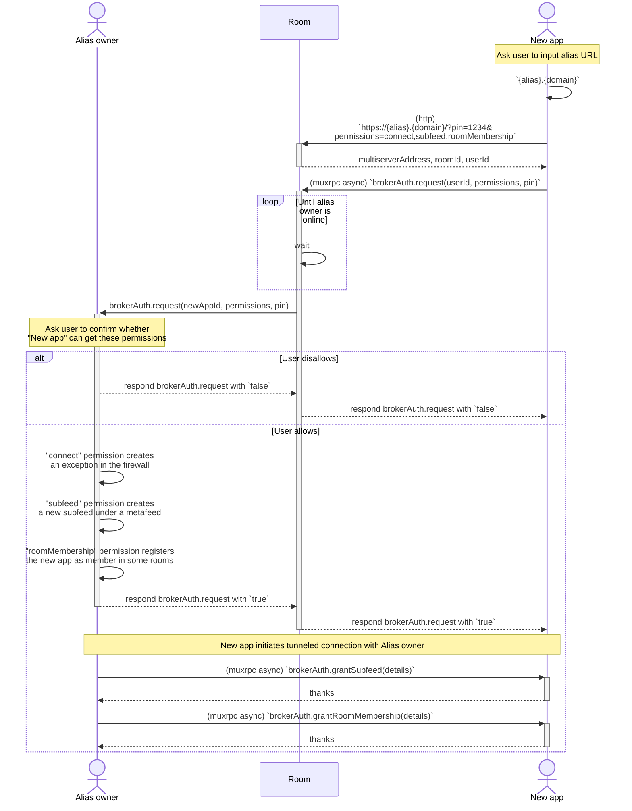
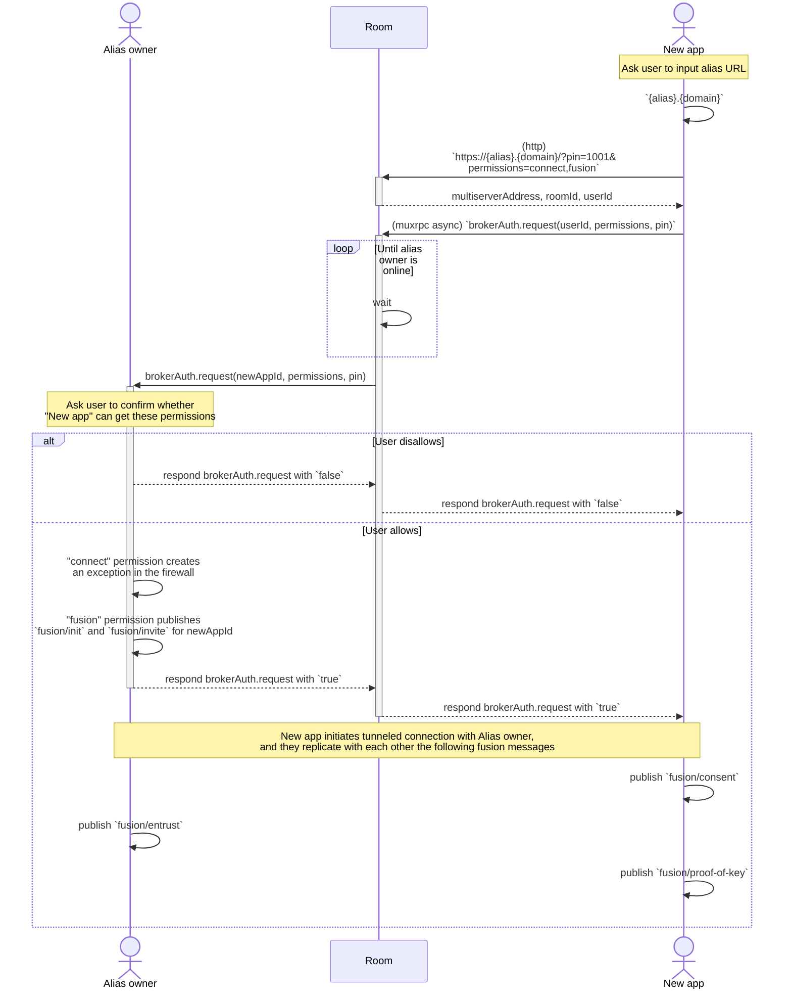

# SSB Room Broker Authentication

**Revision:** DRAFT. DO NOT IMPLEMENT.

**Author:** Andre Medeiros <contact@staltz.com>

**License:** This work is licensed under a [Creative Commons Attribution 4.0 International License](http://creativecommons.org/licenses/by/4.0/).

## The problem, summarized

By default, connections from unknown peers are forbidden by [ssb-conn-firewall](https://github.com/staltz/ssb-conn-firewall/). This is good, for safety, but it makes onboarding more difficult.

When you **invite people** to the network, you want them to be **pre-approved** and open an exception in the firewall, so they can freely connect with you.

When you **install a new SSB app**, you need it to **bootstrap its database** from your existing SSB app, so that the new app has "your content" (or at least social graph) from the beginning.

## The solution, summarized

A remote room client (either an invited friend, or a new SSB app you own), adds some **query params to your _room alias_**, `permissions` or `token`, and then the room will broker these query params to you, such that you can then authorize the connection.

The query params are (either one, but not both simultaneously):

- `permissions`: a list of priviledges the remote peer is asking for, such as
  - Creating an exception in the firewall to allow the connection
  - Creating a new subfeed under a metafeed on the alias owner
  - Making the alias owner follow the remote peer
- `token`: a sequence of bytes created by the alias owner that grants the remote peer with pre-specified permissions
- `pin`: optional 4-number code used to informally identify the remote peer, similar to Bluetooth pairing codes

In general, either one of these two cases apply:

- The alias owner can *pre-approve* some permissions and create a token for those permissions
  - `https://${alias}.${domain}/?token=${T}`
- The remote peer can *ask* for some permissions from the alias owner
  - `https://${alias}.${domain}/?permissions=${commaSeparatedPermissions}&pin=4321`

### Use case: inviting a friend

#### Pre-approve some permissions and create token

#### Consuming the tokenized alias

Note, one variant of this use case is to also include the invited friend into the same room servers that the alias owner is in too, using the `roomMembership` permission.

### Use case: subapp bootstrap

New app wants to be a subfeed of a metafeed belonging to the alias owner, and wants that subfeed to be added as a member in rooms.

Thus the permissions are

- `connect`
- `subfeed` (note, this may require an additional query param to specify the details for the subfeed)
- `roomMembership` (may also require additional query params)

### Use case: fusion dance

New app and old app want to link each other as the same "person".

Thus the permissions are:

- `connect`
- `fusion`

## Security considerations

### Spam on `brokerAuth.request()`

A malicious remote peer could spam the alias owner with several `brokerAuth.request()` calls which in turn spam the end-user with manual approval requests. To mitigate that, there are two tactics: (1) the alias owner can block the SSB ID for that spammy remote peer, (2) the room can rate-limit or ban remote peers.

On the second tactic (room server using rate limiting), the remote peer can never know if a `brokerAuth.request()` call returned `false` due to the alias owner being *offline* or due to the alias owner rejecting it, but the room always knows this information. Thus the room could detect that an alias owner rejected `claim` calls several times for a specific remote peer (identified by its IP address), and thus ban or rate limit that remote peer by IP address or SSB ID, or both.

## What about off-grid use cases?

This proposal heavily relies on room servers over the internet, so there is no solution given for subapp bootstrapping or fusion identity in a local area network, or even on the same device (say, entirely isolated from other devices).

I believe we should make other proposals that are similar to broker auth, but meant primarily for local area network, or primarily for same-device auth.

For local area network authentication, we could replace alias URLs with local-network domains such as `.local` or `.home.arpa`. For instance, for subapp bootstrapping in the same LAN, the old app could have an address such as `$SSBID.local`, the new app can dial that address, and authentication via muxrpc can proceed.

For same-device authentication, either we can use an overkill such as room broker auth (or LAN auth), or we can use a OS-specific solution such as Unix sockets or others.

# Appendix

## List of new muxrpc APIs

- async
  - `brokerAuth.claim(ssbID, token)`
  - `brokerAuth.request(ssbID, permissions, pin)`
  - `brokerAuth.grantRoomMembership(details)`
  - `brokerAuth.grantSubfeed(details)`