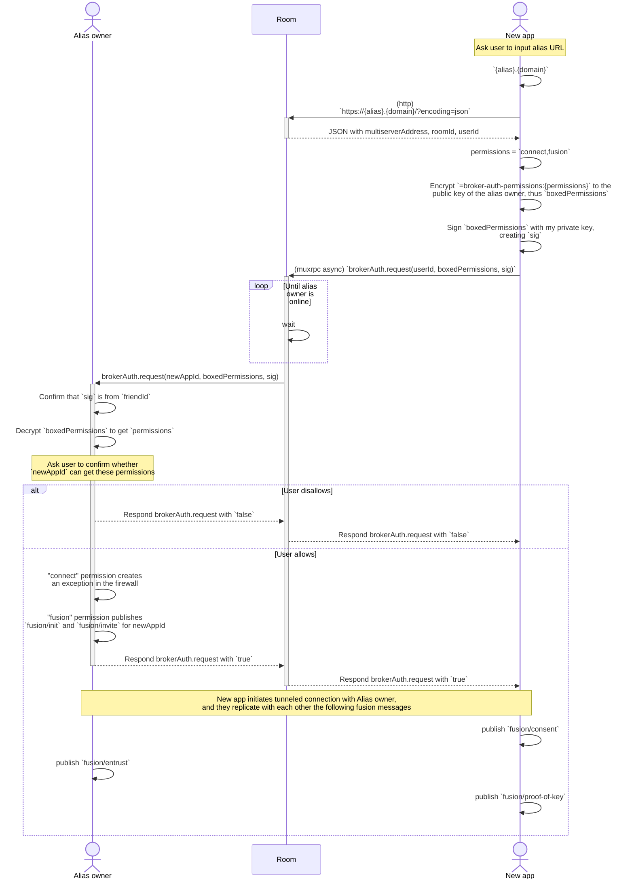

# SSB Room Broker Authentication

**Revision:** DRAFT. DO NOT IMPLEMENT.

**Author:** Andre Medeiros <contact@staltz.com>

**License:** This work is licensed under a [Creative Commons Attribution 4.0 International License](http://creativecommons.org/licenses/by/4.0/).

## The problem, summarized

By default, connections from unknown peers are forbidden by [ssb-conn-firewall](https://github.com/staltz/ssb-conn-firewall/). This is good, for safety, but it makes onboarding more difficult.

When you **invite people** to the network, you want them to be **pre-approved** and open an exception in the firewall, so they can freely connect with you.

When you **install a new SSB app**, you need it to **bootstrap its database** from your existing SSB app, so that the new app has "your content" (or at least social graph) from the beginning.

## The solution, summarized

A remote room client (either an invited friend, or a new SSB app you own) can connect freely to the room server, and upon connection sends some additional data to the room via the muxrpc APIs `brokerAuth.request()` or `brokerAuth.claim()`, which the room will then broker to the alias owner, such that they can then authorize the tunneled connection from remote room client to alias owner.

There are two cases:

1. The remote peer is asking for the alias owner to grant some specific permissions
2. The alias owner has pre-approved some permissions and has given through a 3rd party channel (e.g. via instant messengers or email) a token to the remote peer

In the first case, the muxrpc API used is `brokerAuth.request()`, and in the second case it is `brokerAuth.claim()`. Unlike with tunneled connections, the arguments given to these muxrpc APIs have to be encrypted to the alias owner and signed by the remote peer, to prevent the room from tampering them (which would effectively let the room authenticate whoever they wanted to).

In the case of "claiming" a token, the token is attached to the alias URL in the URI fragment in order to allow only the room's browser-side JavaScript to detect it, not the room server itself. For example, `https://{alias}.{domain}/#{token}`

### Use case: inviting a friend

#### Pre-approve some permissions and create token

#### Consuming the tokenized alias

Note, one variant of this use case is to also include the invited friend into the same room servers that the alias owner is in too, using the `roomMembership` permission.

### Use case: subapp bootstrap

New app wants to be a subfeed of a metafeed belonging to the alias owner, and wants that subfeed to be added as a member in rooms.

Thus the permissions are

- `connect`
- `subfeed` (note, this may require an additional query param to specify the details for the subfeed)
- `roomMembership` (may also require additional query params)

### Use case: fusion dance

New app and old app want to link each other as the same "person".

Thus the permissions are:

- `connect`
- `fusion`

## Security considerations

### Spam on `brokerAuth.request()`

A malicious remote peer could spam the alias owner with several `brokerAuth.request()` calls which in turn spam the end-user with manual approval requests. To mitigate that, there are two tactics: (1) the alias owner can block the SSB ID for that spammy remote peer, (2) the room can rate-limit or ban remote peers.

On the second tactic (room server using rate limiting), the remote peer can never know if a `brokerAuth.request()` call returned `false` due to the alias owner being *offline* or due to the alias owner rejecting it, but the room always knows this information. Thus the room could detect that an alias owner rejected `brokerAuth.request()` calls several times for a specific remote peer (identified by its IP address), and thus ban or rate limit that remote peer by IP address or SSB ID, or both.

## What about off-grid use cases?

This proposal heavily relies on room servers over the internet, so there is no solution given for subapp bootstrapping or fusion identity in a local area network, or even on the same device (say, entirely isolated from other devices).

I believe we should make other proposals that are similar to broker auth, but meant primarily for local area network, or primarily for same-device auth.

For local area network authentication, we could replace alias URLs with local-network domains such as `.local` or `.home.arpa`. For instance, for subapp bootstrapping in the same LAN, the old app could have an address such as `$SSBID.local`, the new app can dial that address, and authentication via muxrpc can proceed.

For same-device authentication, either we can use an overkill such as room broker auth (or LAN auth), or we can use a OS-specific solution such as Unix sockets or others.

# Appendix

## List of new muxrpc APIs

- async
  - `brokerAuth.claim(ssbID, boxedToken, sig)`
  - `brokerAuth.request(ssbID, boxedPermissions, sig)`
  - `brokerAuth.grant(details)`